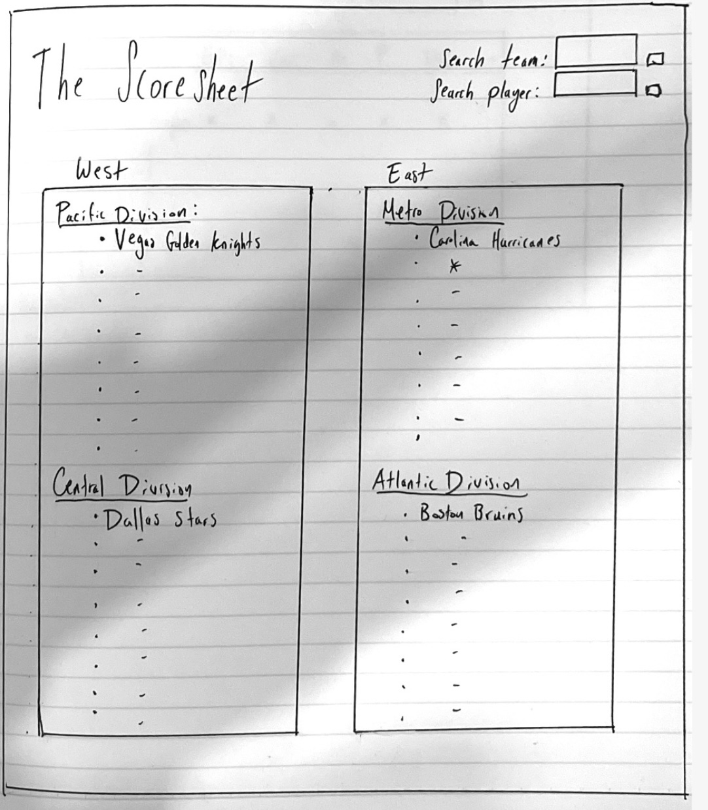
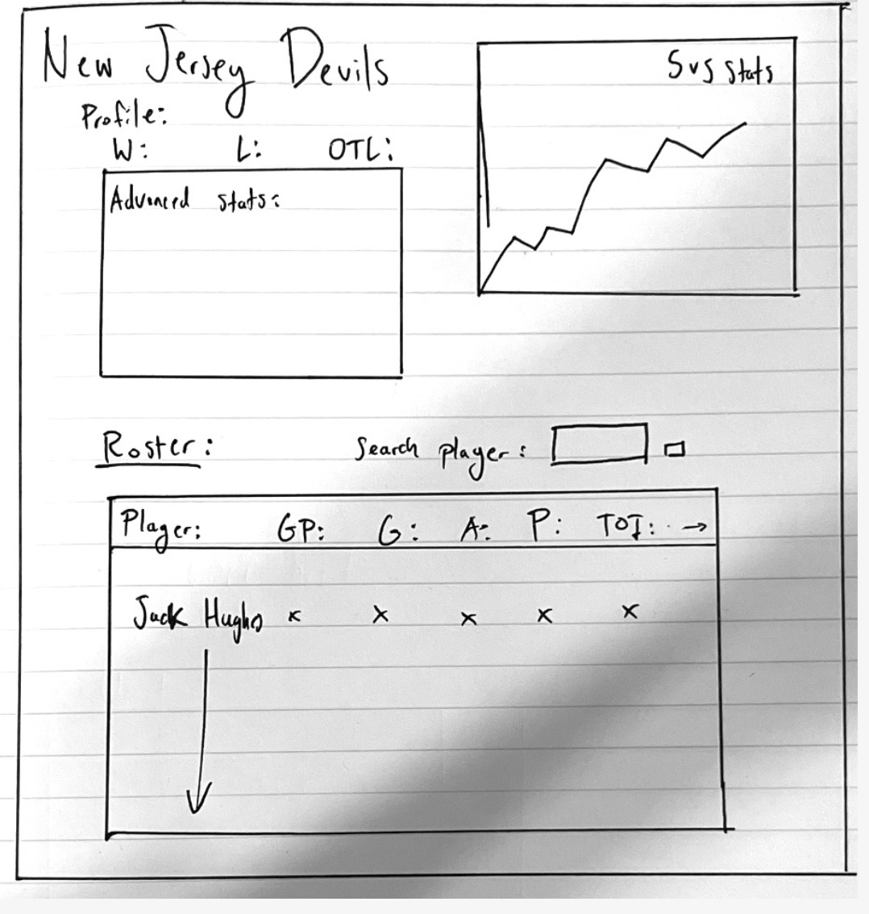
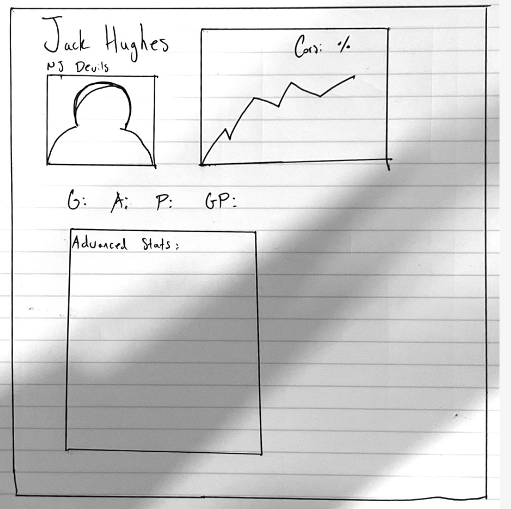
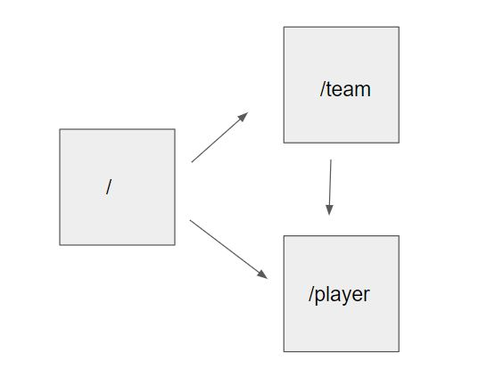

# The Scoresheet

## Overview

Ice Hockey stats aren't just about who has the most goals or points. There are many player metrics that evaluate how efficient they are, how well they are being utilized in different sitautions, or even what sort of habits they have with the puck. 

This app will allow users to track NHL player and team stats for the 2022-23 season. When searching for a specific player or team, users will be able to see their advanced analytics in addition to graph models that show their trends or effectiveness. 


## Data Model

The application will store teams and players

* teams can have multiple stats (via references)
* each player AND team can have multiple advanced stats (by embedding)

An Example Team Schema with Embedded Items:

```javascript
{
  teamName: "New Jersey Devils",
  city: "Newark",
  arena: "Prudential Center,
  coach: "Lindy Ruff",
  division: "Metropolitan",
  conference: "East",
  stats: {
    wins: 45,
    losses: 18.
    OTL: 8,
    points: 98,
    goalDiff: 54,
    powerPlayPercentage: 20.81,
    penaltyKillPercentage: 82.27,
    corsiForPercentage: 53.5,
    expectedGoalsForPercentage: 167.7,
    shootingPercentage: 10.0,
    savePercentage: .924
  }
  players: [{ type: mongoose.Schema.Types.ObjectId, ref: 'Player' }]
}
```

An Example Player Schema with Embedded Items:

```javascript
{
  name: "Jack Hughes",
  position: "C",
  age: 21,
  nationality: "USA",
  team: "New Jersey Devils",
  stats: {
    gamesPlayed: 67,
    goals: 37,
    assists: 44,
    points: 81,
    plusMinus: 7,
    corsiForPercentage: 56.67,
    goalsAboveReplacement: 40.66,
    expectedGoals: 55.05,
    shootingPercentage: 13.27
  }
}
```


## [Link to Commented First Draft Schema](db.mjs) 


## Wireframes


/ - home page that shows all 32 nhl teams by conference and division



/team - page for showing stats of a specific team



/player - page for showing stats of a specific player



## Site map



## User Stories or Use Cases


1. as a user, I can view all 32 teams in the NHL
2. as a user, I can view each of the 32 teams specifically with their pertinent advanced stats
3. as  a user, I can view all the players on each of the 32 teams
4. as a user, I can view each specific player and see their advanced stats. 
5. as a user, I can create my own roster of players.
6. as a user, I can search up any valid player or team.

## Research Topics


* (5 points) Integrate graphic models using a server-side library
    * I'm going to be using jimp to create models for the advanced stats
    * These graphs are drawn on the server and then processed to be used by browser.
* (2 points) Use tailwind.css for styling
    *  provides pre-built styles and utilities
    *  will be used to create responsive and modern user interfaces more efficiently
* (3 points) Use mocha for unit testing
    * use it to write and run automated tests for my application
    * help catch bugs and improve quality of app

10 points total out of 10 required points 


## [Link to Initial Main Project File](app.mjs) 


## Annotations / References Used

1. [jimp tutorial](https://www.chartjs.org/docs/latest/](https://www.tutorialspoint.com/image-processing-with-nodejs-jimp)) 
2. [mocha tutorial](https://www.testim.io/blog/jest-testing-a-helpful-introductory-tutorial/](https://www.geeksforgeeks.org/introduction-to-mocha/)) 
3. [tailwind tutorial](https://tsh.io/blog/tailwind-css-tutorial/)

